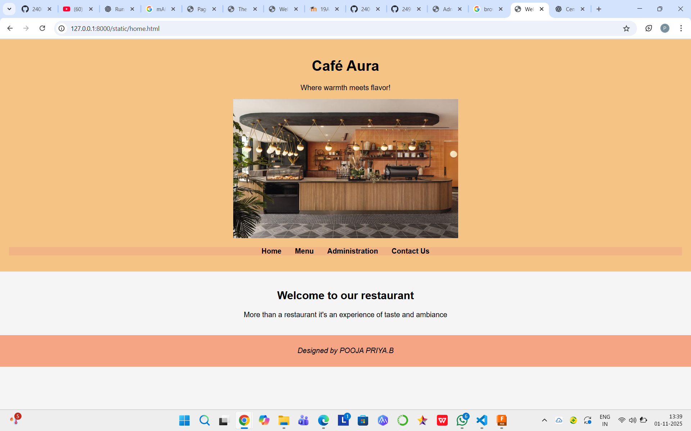
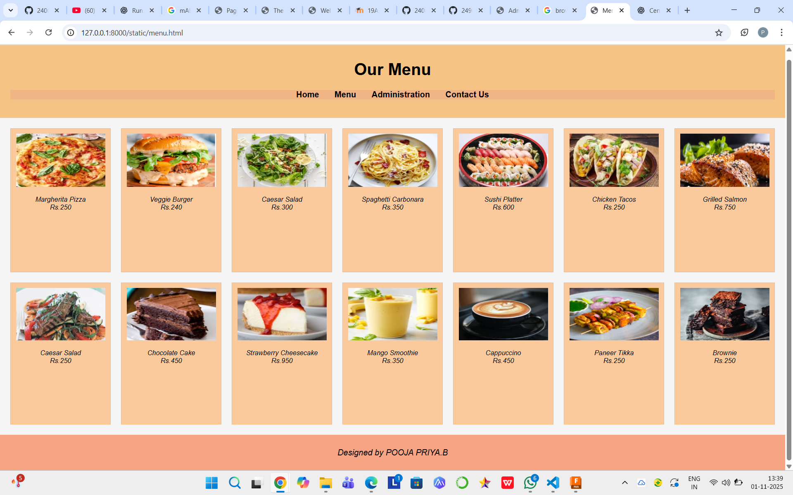
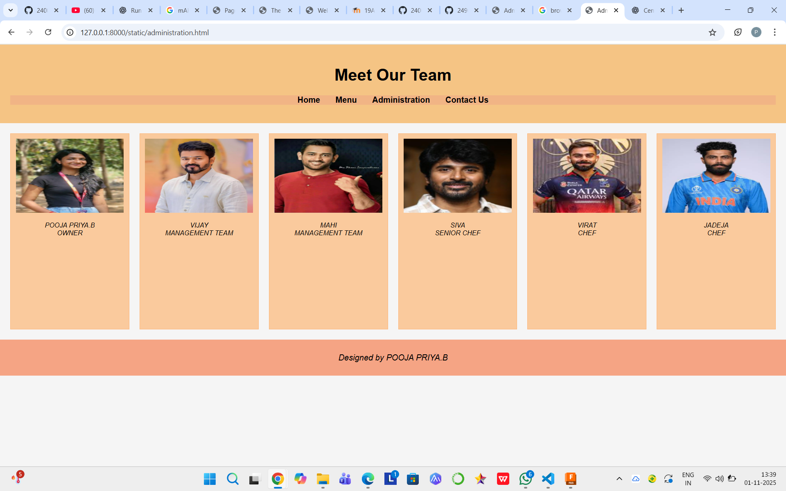
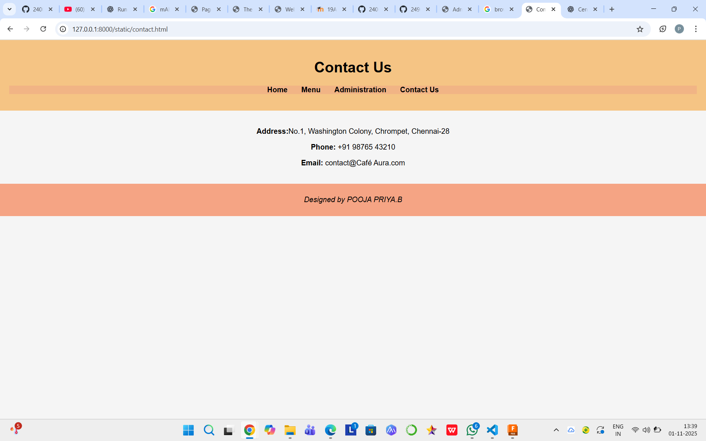

# Ex.07 Restuarant Website
## Date:1/11/25

## AIM:
To develop a static Resturant website to display the menu and services provided by the resturant.

## DESIGN STEPS:

### Step 1:
Requirement collection.

### Step 2:
Creating the layout using HTML and CSS.

### Step 3:
Updating the sample content.

### Step 4:
Choose the appropriate style and color scheme.

### Step 5:
Validate the layout in various browsers.

### Step 6:
Validate the HTML code.

### Step 7:
Publish the website in the given URL.

## PROGRAM:

home.html
```
<!DOCTYPE html>
<html lang="en">
<head>
  <meta charset="UTF-8">
  <title>Welcome to Café Aura</title>
  <link rel="stylesheet" href="style.css">
</head>
<body>
  <header>
    <div class="banner">
      <h1> Café Aura</h1>
      <p>Where warmth meets flavor!</p>
      
    </div>
    <nav>
      <ul>
        <li><a href="home.html">Home</a></li>
        <li><a href="menu.html">Menu</a></li>
        <li><a href="administration.html">Administration</a></li>
        <li><a href="contact.html">Contact Us</a></li>
      </ul>
    </nav>
  </header>
  <main>
    <section class="intro">
      <h2 style="color: black; text-align: center;">Welcome to our restaurant</h2>

      <p style="color: black; text-align: center;">More than a restaurant it's an experience of taste and ambiance</h2>

      
    </section>
  </main>
  <footer>
    <p>Designed by POOJA PRIYA.B</p>
  </footer>
</body>
</html>

```
menu.html
```
<!DOCTYPE html>
<html lang="en">
<head>
  <meta charset="UTF-8">
  <title>Menu</title>
  <link rel="stylesheet" href="style.css">
</head>
<body>
  <header>
    <h1>Our Menu</h1>
    <nav>
      <ul>
        <li><a href="home.html">Home</a></li>
        <li><a href="menu.html">Menu</a></li>
        <li><a href="administration.html">Administration</a></li>
        <li><a href="contact.html">Contact Us</a></li>
      </ul>
    </nav>
  </header>
  <main>
    <div class="grid">
      <div class="card"><p style="text-align:center;">Margherita Pizza <br><span style="display:block;">Rs.250</span></p></div>
      <div class="card"><p style="text-align:center;">Veggie Burger <br><span style="display:block;">Rs.240</span></p></div>
      <div class="card"><p style="text-align:center;">Caesar Salad <br><span style="display:block;">Rs.300</span></p></div>
      <div class="card"><p style="text-align:center;">Spaghetti Carbonara <br><span style="display:block;">Rs.350</span></p></div>
      <div class="card"><p style="text-align:center;">Sushi Platter <br><span style="display:block;">Rs.600</span></p></div>
      <div class="card"><p style="text-align:center;">Chicken Tacos <br><span style="display:block;">Rs.250</span></p></div>
      <div class="card"><p style="text-align:center;">Grilled Salmon <br><span style="display:block;">Rs.750</span></p></div>
      <div class="card"><p style="text-align:center;">Caesar Salad <br><span style="display:block;">Rs.250</span></p></div>
      <div class="card"><p style="text-align:center;">Chocolate Cake<br><span style="display:block;">Rs.450</span></p></div>
      <div class="card"><p style="text-align:center;">Strawberry Cheesecake <br><span style="display:block;">Rs.950</span></p></div>
      <div class="card"><p style="text-align:center;">Mango Smoothie <br><span style="display:block;">Rs.350</span> </p></div>
      <div class="card"><p style="text-align:center;">Cappuccino <br><span style="display:block;">Rs.450</span></p></div>
      <div class="card"><p style="text-align:center;">Paneer Tikka <br><span style="display:block;">Rs.250</span></p></div>
      <div class="card"><p style="text-align:center;">Brownie <br><span style="display:block;">Rs.250</span></p></div>
    </div>
  </main>
  <footer>
    <p>Designed by POOJA PRIYA.B</p>
  </footer>
</body>
</html>
```
administration.html
```
<!DOCTYPE html>
<html lang="en">
<head>
  <meta charset="UTF-8">
  <title>Administration</title>
  <link rel="stylesheet" href="style.css">
</head>
<body>
  <header>
    <h1>Meet Our Team</h1>
    <nav>
      <ul>
        <li><a href="index.html">Home</a></li>
        <li><a href="menu.html">Menu</a></li>
        <li><a href="administration.html">Administration</a></li>
        <li><a href="contact.html">Contact Us</a></li>
      </ul>
    </nav>
  </header>
  <main>
    <div class="grid">
    <div class="card"><p style="text-align:center;">POOJA PRIYA.B<br><span style="display:block;">OWNER</span></p></div>
    <div class="card"><p style="text-align:center;">VIJAY<br><span style="display:block;">MANAGEMENT TEAM</span></p></div>
    <div class="card"><p style="text-align:center;">MAHI<br><span style="display:block;">MANAGEMENT TEAM</span></p></div>
    <div class="card"><p style="text-align:center;">SIVA<br><span style="display:block;">SENIOR CHEF</span></p></div>
    <div class="card"><p style="text-align:center;">VIRAT<br><span style="display:block;">CHEF</span></p></div>
    <div class="card"><p style="text-align:center;">JADEJA<br><span style="display:block;">CHEF</span></p></div>
    </div>
  </main>
  <footer>
    <p>Designed by POOJA PRIYA.B</p>
  </footer>
</body>
</html>
```
contact.html

```
<!DOCTYPE html>
<html lang="en">
<head>
  <meta charset="UTF-8">
  <title>Contact Us</title>
  <link rel="stylesheet" href="style.css">
</head>
<body>
  <header>
    <h1>Contact Us</h1>
    <nav>
      <ul>
        <li><a href="home.html">Home</a></li>
        <li><a href="menu.html">Menu</a></li>
        <li><a href="administration.html">Administration</a></li>
        <li><a href="contact.html">Contact Us</a></li>
      </ul>
    </nav>
  </header>
  <main>
    <section class="contact-info">
     

      <p style="color: black; text-align: center"><strong>Address:</strong>No.1, Washington Colony, Chrompet, Chennai-28</p>
      <p style="color: black; text-align: center"><strong>Phone:</strong> +91 98765 43210</p>
      <p style="color: black; text-align: center"><strong>Email:</strong> contact@Café Aura.com</p>
    </section>
  </main>
  <footer>
    <p>Designed by POOJA PRIYA.B</p>
  </footer>
</body>
</html>


```

## OUTPUT:





## RESULT:
The program for designing software company website using HTML and CSS is completed successfully.
